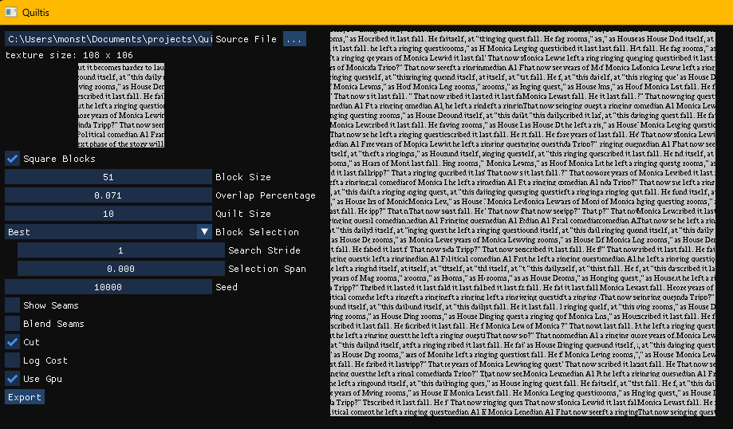

# Quiltis

Quiltis is a library implementing an image synthetizing algorithm known as _image quilting_, as [presented in this 2001 paper](https://people.eecs.berkeley.edu/~efros/research/quilting/quilting.pdf).

It works by selecting blocks from the original image and placing them next to each other with a little bit of overlap. Then it finds where to cut the block in that overlap so that the seam is the least obvious.  
This is done by substracting each overlapping pixel and taking the magnitude of the result to create an error map and then running A* pathfinding to find the minimum error path. The pixels on the other side of that path are simply erased.


To get better result we can try to select a block that already has a low average error in the overlapping part. In the original paper the application was quite slow because it has to check each block position from the original picture to find the optimal one. I used a shader to speed up this process, which lead to ~x8 speed gain. This optimization in addition to the general increase in speed of computers since the paper came out means that the we can now generate bigger image in less than a second, compared to the original results that were significantly smaller and took multiple minutes to generate.

## App

The library comes with a simple app, using imgui  
On the left you can see the original image and the paramters  
On the right there's the resulting image, made of 10 by 10 blocks  


You can also see where the seams are generated


## Tiling

By selecting the same blocks on opposite edges of the image we make the result tileable


## Library

The library depends on SFML.  
You can setup a simple project using a cmake file such as:

```cmake
cmake_minimum_required(VERSION 3.28)
project(app LANGUAGES CXX)

include(FetchContent)

FetchContent_Declare(SFML
    GIT_REPOSITORY https://github.com/SFML/SFML.git
    GIT_TAG 3.0.0
    GIT_SHALLOW ON
    EXCLUDE_FROM_ALL
    SYSTEM)
FetchContent_MakeAvailable(SFML)

FetchContent_Declare(Quiltis
    GIT_REPOSITORY https://github.com/lapinozz/Quiltis
    GIT_SHALLOW ON
    EXCLUDE_FROM_ALL
    SYSTEM)
FetchContent_MakeAvailable(Quiltis)

add_executable(app main.cpp)

target_compile_features(app PRIVATE cxx_std_20)
set_property(TARGET app PROPERTY CXX_STANDARD 20)

target_link_libraries(app PRIVATE Quiltis::Quiltis nfd SFML::Graphics)

```

As for using it, the interface is really simple:
```cpp
#include <SFML/Graphics.hpp>
#include "quiltis.hpp"

int main()
{
    sf::Image sourceImg("path/to/image.png");

    Quiltis::Settings settings;
    settings.blockSize = sf::Vector2i(100, 100);

    sf::Image resultImg = Quiltis::quilt(sourceImg, settings);
    resultImg.saveToFile("path/to/save.png");
}

```

## More examples





